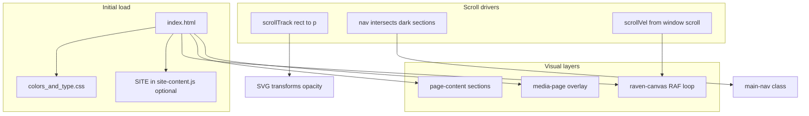

# hug&mun labs — site architecture

This document describes the **public marketing site** as implemented today: what files exist, how the page is structured, where links go, and how the main interactive layers (scroll-scrubbed hero, raven background, media overlay) work.

---

## High-level shape

- **Single primary document:** `index.html` is the whole public site in one file: inline CSS, markup, and several small inline scripts at the bottom.
- **No build step** for the landing page itself; open `index.html` in a browser (or serve the repo root) and it runs.
- **Design tokens and fonts:** `Hug&Mun Labs Design System/colors_and_type.css`
- **Content mirror (optional / future):** `content/site-content.js` defines a `window.SITE` object with the same copy as the page. The HTML is **not** currently hydrated from `SITE`; the script is loaded for reference or future tooling. Keep copy in sync manually if you edit both.

Other HTML under `Hug&Mun Labs Design System/` (previews, `Mission and Vision _clean_.html`, etc.) is **design-system tooling**, not part of the live landing route unless you link to it explicitly.

---

## Repository layout (site-relevant)

| Path | Role |
|------|------|
| `index.html` | Landing page: structure, styles, behavior |
| `favicon.svg` | Favicon |
| `Hug&Mun Labs Design System/colors_and_type.css` | Colors, typography, radii, motion tokens |
| `Hug&Mun Labs Design System/assets/*.svg` | Logos, symbols (Huginn, Muninn, Odin eye, rune divider, etc.) |
| `public/hug-mun-vid.mp4` | Looping lab video (Media overlay) |
| `papers/gentags-pre.pdf` | Linked from hero and Gentags section |
| `content/site-content.js` | Structured copy; exposes `window.SITE` |

---

## External dependencies

- **Lucide icons** — `https://unpkg.com/lucide@latest`; `lucide.createIcons()` runs once after load for GitHub / Twitter / RSS icons in the nav (links are still `#` placeholders).

---

## Page regions (top to bottom)

Content lives inside `.page-content` except the **media panel**, which is a sibling **after** `.page-content` so it can fullscreen above everything.

### 1. Sticky nav (`#main-nav`)

- **Left links:** Experiments → `#first-result`, Research → `#hero`, About → `#about`, Media → `#media` (handled by JS: prevents default scroll, opens overlay).
- **Center:** Logo + wordmark → `#` (top of page).
- **Right:** GitHub, Twitter, RSS — all `href="#"` until real URLs are set.

**Nav theme (light vs dark):** A small script toggles `.nav-light` on the nav when the nav’s bottom edge is **not** overlapping “dark” sections. Dark targets are `.mv-page` and `.vision` (only `.mv-page` exists in the current HTML; `.vision` is reserved if that block is added). While `#media` is open (`body.media-open`), the nav stays **dark** so it matches the overlay chrome.

### 2. Full-viewport canvas (`#raven-canvas`)

- Fixed under content (`z-index: 0`), `pointer-events: none`.
- Pixel-style ambient ravens (see **Raven background** below).

### 3. Mission & vision (`#experiments`)

- Full-height dark section (`mv-page`): mission / vision columns, “How we work” body copy.
- **Note:** The fragment is `id="experiments"` but the nav item **“Experiments”** scrolls to **`#first-result`** (Gentags), not here. There is no in-nav anchor to Mission & vision unless you add one.

### 4. Scroll-scrubbed hero (`#hero`)

- The main “research” story + **SVG scene** driven by scroll (see **Scroll-scrubbed hero** below).

### 5. Tagline strip

- Short line: “Experiments, research, and notes from the lab.”

### 6. Core idea (`#about`)

- Thesis-style block: explicit state vs implicit context, bullet outcomes.

### 7. Pipeline

- Four steps: Semantic state → Context state → Belief state → Decision (inline-styled; step 3 marked active in CSS terms).

### 8. First result / Gentags (`#first-result`)

- Paper teaser + button to `papers/gentags-pre.pdf`, ACL meta line.

### 9. What we’re testing

- Bullet list; no dedicated `id` (only reached by scrolling).

### 10. Explorations

- Memory themes; no dedicated `id`.

### 11. Logo strip

- Centered wordmark before footer.

### 12. Footer

- Columns: Research (`#first-result` as “Papers”), Lab (`#about`), Contact (email + location).
- Legal row: Privacy / Terms / RSS — placeholders `#`.
- Copyright 2026, rune footer motif.

### 13. Media overlay (`#media`, `.media-page`)

- **Not** inside `.page-content`. When open: `body.media-open` hides main content from view/pointer events, shows full-screen dark panel with dot grid, “Symbols & motifs” copy, asset list, and **sticky** phone-width video (`#lab-video-el`, `public/hug-mun-vid.mp4`).
- **Open:** Nav “Media” → `openMedia(true)` → `history.pushState` to `#media`, scroll to top, play video (best-effort `play()`).
- **Close:** Back button, Escape, or clearing hash via `history.replaceState`; video pauses.
- **Deep link:** Loading or returning to `...#media` opens the overlay (`popstate` / initial check).

---

## Scroll-scrubbed hero — design and mechanics

### Why it exists

The hero tells the Huginn / Muninn / belief narrative **in sync with scroll** instead of a one-shot animation: the user “scrubs” time by moving through a **tall track** while the **stage stays sticky** under the nav.

### Layout

- **Track:** `.scroll-hero-track` (`#scrollTrack`) height **`400vh`** desktop, **`500vh`** under `900px` width — longer scrub on small screens because the progress UI is hidden there.
- **Stage:** `.scroll-hero-stage` is `position: sticky; top: 60px` (nav height); height `calc(100vh - 60px)` (mobile adjusts `top` / height for wrapped nav).
- **Progress:** Bottom bar maps overall scrub `p ∈ [0,1]` to act name, percentage, and fill width. **“Scroll to summon”** hint fades out early (`opacity` tied to `p`).

### Scroll position → parameter `p`

- `getBoundingClientRect()` on the track vs viewport; `p = clamp(-rect.top / (rect.height - innerHeight), 0, 1)`.
- Scroll and resize listeners coalesce with `requestAnimationFrame` (`ticking` flag).

### Narrative “acts” (progress labels)

Defined in script as `ACTS` with thresholds: Rest → Huginn flight · tags crystallize → Muninn flight · ribbon weaves → Return · belief integrates → Decision → Reset. The **caption** strip cycles four paragraphs via `captionIndex(p)` (different thresholds than act names — intentional layering of microcopy vs macro act).

### SVG layers (all in one inline `<svg class="scene">`)

Rough timeline in `p`:

| Approx range | Effect |
|--------------|--------|
| Early | Language fragments dim slightly mid-scrub |
| ~0.12–0.35 | **Huginn** moves along a quadratic Bezier from perch → off left; slight wobble; tilt |
| ~0.35–0.55 | **Muninn** mirrors to the right; **ribbon** path draws via `stroke-dashoffset`; **particles** brighten |
| ~0.15+ | **Tags** pop in staggered with scale ease |
| ~0.55–0.72 | Birds return to perch; tilts ease to 0 |
| ~0.70–0.78 | **Odin’s eye** crossfades closed → open |
| ~0.72–0.82 | **Constellation** (“belief”) fades in with a subtle pulse scale around center |
| ~0.82–0.88 | **Odin group** small vertical “strike” bob; **impact** ring expands and fades |
| ~0.85–0.90 / out | **Rune** text `ᚨ` fades in then out near end of cycle |

**Easing:** `ease()` (quadratic in / ease-out cubic), `range()` for segment normalization, `lerp` / `bez` for motion.

### CSS tied to the hero

- `.stage-caption p` only one `.active` at a time; opacity / `translateY` transitions.
- Eyebrow dot uses infinite **`pulse`** keyframes.
- Scroll hint chevron uses **`nudge`** keyframes.
- Decorative runes on the stage (`::before` / `::after`) hidden on small breakpoints together with progress UI.

### Decision: `html { scroll-behavior: auto; }`

Smooth scrolling is **off** so hash navigation and the scroll-linked math stay predictable and don’t fight the scrubbed timeline.

---

## Raven background — design and mechanics

### Why it exists

Ambient **pixel crows** fly across the full viewport, reinforcing the Norse raven motif without blocking interaction.

### Implementation

- **2D canvas** + `imageSmoothingEnabled = false` for crisp pixels; DPR-aware resize.
- **Sprites:** 16×10 bitmap frames in `FRAMES` (three frames cycled), black `#000000`.
- **Two ravens** at scales `4` and `3`, horizontal offsets so they don’t stack.
- **Motion:** Slow drift right (`baseSpeed` + scale-dependent boost). When **`scrollVel`** spikes (scroll delta accumulated each frame, decay ×0.93), flap speed increases and vertical motion gets a **scroll-linked nudge** (`clampedVel * 0.05 * depth`). Vertical position clamped; when a raven exits right it respawns left with random Y.
- **Bob:** `Math.sin(bobPhase)` vertical wobble; phase speeds up slightly with scroll “energy.”

This is entirely decorative: no interaction, no accessibility surface beyond visual mood.

---

## CSS “inventory” vs what’s in the DOM

The `<style>` block includes components for **hypotheses**, **vision**, **duality** panels, etc. Those **section classes are not present** in the current `index.html` body; the rules are either legacy or reserved for a future block. Nav already references `.vision` for theming if you add it later.

---

## Media and assets checklist

- **Video:** `public/hug-mun-vid.mp4` (Media overlay). Commented block in Mission & vision once referenced the same path for an inline preview — currently commented out.
- **Paper:** `papers/gentags-pre.pdf`
- **Logos / symbols:** under `Hug&Mun Labs Design System/assets/` (`logo-mark-mono.svg`, `logo-mark-duo.svg`, `logo-huginn.svg`, `logo-muninn.svg`, `odin-eye.svg`, `rune-divider.svg`, …)

---

## Events and custom hooks

| Event / hook | Purpose |
|--------------|---------|
| `hugmun-nav-recheck` (`CustomEvent`) | Dispatched when media opens/closes or hash changes so the nav recomputes light/dark immediately |

---

## Accessibility notes (current state)

- Media overlay toggles `aria-hidden` on `#media`; Back is a real `<button>`.
- Decorative / complex SVG hero has no screen-reader-specific descriptions beyond surrounding text.
- Many links are still `#` placeholders.

---

## Summary diagram (information flow)

If you extend the site (split files, router, CMS), treat this file as the **behavioral spec** for what `index.html` currently implements and update it when behavior or anchors change.
