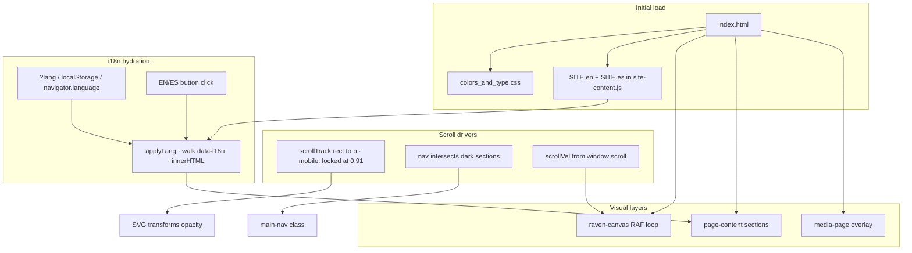

# hug&mun labs — site architecture

This document describes the **public marketing site** as implemented today: what files exist, how the page is structured, where links go, and how the main interactive layers (scroll-scrubbed hero, raven background, media overlay) work.

---

## High-level shape

- **Single primary document:** `index.html` is the whole public site in one file: inline CSS, markup, and several small inline scripts at the bottom.
- **No build step** for the landing page itself; open `index.html` in a browser (or serve the repo root) and it runs.
- **Design tokens and fonts:** `Hug&Mun Labs Design System/colors_and_type.css`
- **Content / translations (live):** `content/site-content.js` defines `window.SITE = { en: {...}, es: {...} }` — a structured copy bank for both languages. The HTML uses **English as the default** baked into the markup, and is **hydrated at runtime** for any element carrying a `data-i18n="<dotted.key>"` attribute. See **Internationalization (i18n)** below.

Other HTML under `Hug&Mun Labs Design System/` (previews, `Mission and Vision _clean_.html`, etc.) is **design-system tooling**, not part of the live landing route unless you link to it explicitly.

---

## Repository layout (site-relevant)

| Path | Role |
|------|------|
| `index.html` | Landing page: structure, styles, behavior |
| `favicon.svg` | Favicon |
| `Hug&Mun Labs Design System/colors_and_type.css` | Colors, typography, radii, motion tokens |
| `Hug&Mun Labs Design System/assets/*.svg` | Logos, symbols (Huginn, Muninn, Odin eye, rune divider, etc.) |
| `public/hug-mun-vid.mp4` | Looping lab video (Media overlay) |
| `papers/gentags-pre.pdf` | Linked from hero and Gentags section |
| `content/site-content.js` | Bilingual copy bank; exposes `window.SITE.{en,es}` — read by the i18n hydrator in `index.html` |

---

## External dependencies

- **Lucide icons** — `https://unpkg.com/lucide@latest`; `lucide.createIcons()` runs once after load for GitHub / Twitter / RSS icons in the nav (links are still `#` placeholders).

---

## Page regions (top to bottom)

Content lives inside `.page-content` except the **media panel**, which is a sibling **after** `.page-content` so it can fullscreen above everything.

### 1. Sticky nav (`#main-nav`)

- **Left links:** Experiments → `#first-result`, Research → `#hero`, About → `#about`, Media → `#media` (handled by JS: prevents default scroll, opens overlay). Each link carries a `data-i18n="nav.*"` key.
- **Center:** Logo + wordmark → `#` (top of page).
- **Right:** `.nav-lang` **EN / ES toggle** (two `<button data-lang-btn>` elements separated by `.lang-sep`), then GitHub, Twitter, RSS — all `href="#"` until real URLs are set. The toggle has its own dark/light styling that follows the nav theme.

**Nav theme (light vs dark):** A small script toggles `.nav-light` on the nav when the nav’s bottom edge is **not** overlapping “dark” sections. Dark targets are `.mv-page` and `.vision` (only `.mv-page` exists in the current HTML; `.vision` is reserved if that block is added). While `#media` is open (`body.media-open`), the nav stays **dark** so it matches the overlay chrome.

### 2. Full-viewport canvas (`#raven-canvas`)

- Fixed under content (`z-index: 0`), `pointer-events: none`.
- Pixel-style ambient ravens (see **Raven background** below).

### 3. Mission & vision (`#experiments`)

- Full-height dark section (`mv-page`): mission / vision columns, “How we work” body copy.
- **Note:** The fragment is `id="experiments"` but the nav item **“Experiments”** scrolls to **`#first-result`** (Gentags), not here. There is no in-nav anchor to Mission & vision unless you add one.

### 4. Scroll-scrubbed hero (`#hero`)

- The main “research” story + **SVG scene** driven by scroll (see **Scroll-scrubbed hero** below).
- On viewports ≤ 900px the scrub is **disabled** and the SVG is locked to its final frame; all four captions render stacked as static narrative copy. Details under **Mobile fallback** in the same section.

### 5. Tagline strip

- Short line: “Experiments, research, and notes from the lab.”

### 6. Core idea (`#about`)

- Thesis-style block: explicit state vs implicit context, bullet outcomes.

### 7. Pipeline

- Four steps: Semantic state → Context state → Belief state → Decision (inline-styled; step 3 marked active in CSS terms).

### 8. First result / Gentags (`#first-result`)

- Paper teaser + button to `papers/gentags-pre.pdf`, ACL meta line.

### 9. What we’re testing

- Bullet list; no dedicated `id` (only reached by scrolling).

### 10. Explorations

- Memory themes; no dedicated `id`.

### 11. Logo strip

- Centered wordmark before footer.

### 12. Footer

- Columns: Research (`#first-result` as “Papers”), Lab (`#about`), Contact (email + location).
- Legal row: Privacy / Terms / RSS — placeholders `#`.
- Copyright 2026, rune footer motif.

### 13. Media overlay (`#media`, `.media-page`)

- **Not** inside `.page-content`. When open: `body.media-open` hides main content from view/pointer events, shows full-screen dark panel with dot grid, “Symbols & motifs” copy, asset list, and **sticky** phone-width video (`#lab-video-el`, `public/hug-mun-vid.mp4`).
- **Open:** Nav “Media” → `openMedia(true)` → `history.pushState` to `#media`, scroll to top, play video (best-effort `play()`).
- **Close:** Back button, Escape, or clearing hash via `history.replaceState`; video pauses.
- **Deep link:** Loading or returning to `...#media` opens the overlay (`popstate` / initial check).

---

## Scroll-scrubbed hero — design and mechanics

### Why it exists

The hero tells the Huginn / Muninn / belief narrative **in sync with scroll** instead of a one-shot animation: the user “scrubs” time by moving through a **tall track** while the **stage stays sticky** under the nav.

### Layout

- **Track:** `.scroll-hero-track` (`#scrollTrack`) height **`400vh`** desktop, **`500vh`** under `900px` width — longer scrub on small screens because the progress UI is hidden there.
- **Stage:** `.scroll-hero-stage` is `position: sticky; top: 60px` (nav height); height `calc(100vh - 60px)` (mobile adjusts `top` / height for wrapped nav).
- **Progress:** Bottom bar maps overall scrub `p ∈ [0,1]` to act name, percentage, and fill width. **“Scroll to summon”** hint fades out early (`opacity` tied to `p`).

### Scroll position → parameter `p`

- `getBoundingClientRect()` on the track vs viewport; `p = clamp(-rect.top / (rect.height - innerHeight), 0, 1)`.
- Scroll and resize listeners coalesce with `requestAnimationFrame` (`ticking` flag).

### Narrative “acts” (progress labels)

Defined in script as `ACTS` with thresholds: Rest → Huginn flight · tags crystallize → Muninn flight · ribbon weaves → Return · belief integrates → Decision → Reset. The **caption** strip cycles four paragraphs via `captionIndex(p)` (different thresholds than act names — intentional layering of microcopy vs macro act).

### SVG layers (all in one inline `<svg class="scene">`)

Rough timeline in `p`:

| Approx range | Effect |
|--------------|--------|
| Early | Language fragments dim slightly mid-scrub |
| ~0.12–0.35 | **Huginn** moves along a quadratic Bezier from perch → off left; slight wobble; tilt |
| ~0.35–0.55 | **Muninn** mirrors to the right; **ribbon** path draws via `stroke-dashoffset`; **particles** brighten |
| ~0.15+ | **Tags** pop in staggered with scale ease |
| ~0.55–0.72 | Birds return to perch; tilts ease to 0 |
| ~0.70–0.78 | **Odin’s eye** crossfades closed → open |
| ~0.72–0.82 | **Constellation** (“belief”) fades in with a subtle pulse scale around center |
| ~0.82–0.88 | **Odin group** small vertical “strike” bob; **impact** ring expands and fades |
| ~0.85–0.90 / out | **Rune** text `ᚨ` fades in then out near end of cycle |

**Easing:** `ease()` (quadratic in / ease-out cubic), `range()` for segment normalization, `lerp` / `bez` for motion.

### CSS tied to the hero

- `.stage-caption p` only one `.active` at a time; opacity / `translateY` transitions.
- Eyebrow dot uses infinite **`pulse`** keyframes.
- Scroll hint chevron uses **`nudge`** keyframes.
- Decorative runes on the stage (`::before` / `::after`) hidden on small breakpoints together with progress UI.

### Decision: `html { scroll-behavior: auto; }`

Smooth scrolling is **off** so hash navigation and the scroll-linked math stay predictable and don’t fight the scrubbed timeline.

### Mobile fallback (≤ 900px): scrub disabled, SVG locked

On phones the scrubbed timeline is replaced with a flowing static section:

- **CSS** (`@media (max-width: 900px)`): track becomes `height: auto`, stage becomes `position: static`, single-column grid (`text` over `scene`), 280px max SVG, all 4 captions render stacked (no fixed-height absolute positioning), progress bar and scroll hint are hidden.
- **JS:** the hero IIFE listens to `window.matchMedia('(max-width: 900px)')`. When matching, it **detaches the scroll/resize listeners** and calls `update(0.91)` once — locking the scene in its climactic frame (Odin’s eye open, constellation lit, ravens at perch, rune visible). When the viewport widens past 900px the listeners are reattached and the live scrub resumes.
- **Why 0.91**: chosen so the final-state composition shows eye + constellation + rune without the impact ring or rune-fade still in motion.
- **Captions:** the script keeps assigning `.active` to the 4th caption, but mobile CSS overrides positioning so all four paragraphs flow as a regular vertical stack — the user reads the **whole Huginn → Muninn → belief arc** as static narrative copy.

There’s a parallel `@media (max-width: 720px)` block that handles **section-level mobile fixes** below the hero: `.thesis` padding tightens (48px → 24px), `.pipeline` stacks vertically with arrows rotated 90°, `.footer-grid` collapses 4 cols → 2 cols (brand spans full width), `.vision-list` and `.hyp-grid` go to 1 col.

---

## Internationalization (i18n)

The site ships **English by default in the markup**, and **hydrates at runtime** to whatever language is selected. Both the source-of-truth dictionary and the runtime hydrator live in two files only:

- `content/site-content.js` — defines `window.SITE = { en: {...}, es: {...} }`. Each language sub-tree mirrors the same keyed shape (`nav.*`, `mv.*`, `hero.*`, `tagline`, `core.*`, `pipeline.*`, `paper.*`, `testing.*`, `explorations.*`, `footer.*`, `meta.title`).
- An inline `<script>` in `index.html` (right after `site-content.js`) does the hydration.

### Markup contract

Translatable nodes carry a `data-i18n="<dotted.key>"` attribute, e.g. `<h1 data-i18n="hero.headline">…</h1>`. The script replaces `innerHTML` (so values can include inline markup like `<strong>`, ``, ``, etc. — which Spanish copy uses for the same emphasis points).

For lists where a `<li>` already contains a decorative bullet ``, the translatable text is wrapped in an inner `` so the bullet survives the swap.

### Language picker

- Two `<button data-lang-btn="en|es">` elements inside `.nav-lang` (in `.nav-right`).
- `.active` class + `aria-pressed` reflect the current language.
- CSS adapts to dark and light nav themes (`.nav-light .lang-btn.active` flips to `var(--ink-900)`).

### Resolution order on load

1. `?lang=en|es` URL query param (sharable links).
2. `localStorage.getItem('hugmun.lang')` (last user choice).
3. `navigator.language` — if it starts with `es`, default to Spanish.
4. Fallback `en`.

### Hydration step

`applyLang(lang)`:

1. Validates `lang ∈ {en, es}`.
2. Sets `<html lang="…">`.
3. Walks every `[data-i18n]` element, resolves the dotted key against `SITE[lang]` via reduce, and assigns `innerHTML` if a value is found.
4. Sets `document.title` from `SITE[lang].meta.title`.
5. Toggles `.active` / `aria-pressed` on the `[data-lang-btn]` buttons.
6. Persists to `localStorage` under `hugmun.lang`.
7. Dispatches `hugmun-lang-change` (custom event with `detail.lang`) for any future listener.
8. Exposes itself as `window.hugmunSetLang(lang)` for console / debug use.

### Brand-term policy (kept in English in both languages)

`hug&mun`, `hug&mun labs`, `Huginn`, `Muninn`, `Gentags`, `ACL 2026`, `Hug&Mun Labs`. Section labels (`Mission`, `Vision`, `Core idea`, `First result`, `Explorations`, `Research`, `Lab`, `Contact`, etc.) and CTAs (`Read the thesis` / `Leer la tesis`, `Read the paper` / `Leer el artículo`) are translated. "Paper" in any user-facing copy is rendered as **artículo** in Spanish, never "paper".

### Adding a new language

1. Add a sub-tree under `SITE` (e.g. `SITE.fr = { ...same keys as en/es... }`).
2. Add `'fr'` to the `SUPPORTED` array in the inline hydration script.
3. Add a third `<button data-lang-btn="fr">` inside `.nav-lang` (and adjust the CSS gap if needed).

### Adding a new translatable string

1. Add the key to **both** `SITE.en` and `SITE.es` (and any other languages).
2. Put `data-i18n="<dotted.key>"` on the markup node — the English text inside the tag becomes the no-JS / pre-hydration fallback.

---

## Raven background — design and mechanics

### Why it exists

Ambient **pixel crows** fly across the full viewport, reinforcing the Norse raven motif without blocking interaction.

### Implementation

- **2D canvas** + `imageSmoothingEnabled = false` for crisp pixels; DPR-aware resize.
- **Sprites:** 16×10 bitmap frames in `FRAMES` (three frames cycled), black `#000000`.
- **Two ravens** at scales `4` and `3`, horizontal offsets so they don’t stack.
- **Motion:** Slow drift right (`baseSpeed` + scale-dependent boost). When **`scrollVel`** spikes (scroll delta accumulated each frame, decay ×0.93), flap speed increases and vertical motion gets a **scroll-linked nudge** (`clampedVel * 0.05 * depth`). Vertical position clamped; when a raven exits right it respawns left with random Y.
- **Bob:** `Math.sin(bobPhase)` vertical wobble; phase speeds up slightly with scroll “energy.”

This is entirely decorative: no interaction, no accessibility surface beyond visual mood.

---

## CSS “inventory” vs what’s in the DOM

The `<style>` block includes components for **hypotheses**, **vision**, **duality** panels, etc. Those **section classes are not present** in the current `index.html` body; the rules are either legacy or reserved for a future block. Nav already references `.vision` for theming if you add it later.

---

## Media and assets checklist

- **Video:** `public/hug-mun-vid.mp4` (Media overlay). Commented block in Mission & vision once referenced the same path for an inline preview — currently commented out.
- **Paper:** `papers/gentags-pre.pdf`
- **Logos / symbols:** under `Hug&Mun Labs Design System/assets/` (`logo-mark-mono.svg`, `logo-mark-duo.svg`, `logo-huginn.svg`, `logo-muninn.svg`, `odin-eye.svg`, `rune-divider.svg`, …)

---

## Events and custom hooks

| Event / hook | Purpose |
|--------------|---------|
| `hugmun-nav-recheck` (`CustomEvent`) | Dispatched when media opens/closes or hash changes so the nav recomputes light/dark immediately |
| `hugmun-lang-change` (`CustomEvent`, `detail: { lang }`) | Dispatched after every language swap so other scripts can react (none currently listen) |
| `window.hugmunSetLang(lang)` | Exposed by the i18n script — call from console / future code to swap language imperatively |
| `matchMedia('(max-width: 900px)').change` (in hero IIFE) | Toggles between scrub-bound scroll listeners (desktop) and the locked final frame (`update(0.91)`) on mobile |

---

## Accessibility notes (current state)

- Media overlay toggles `aria-hidden` on `#media`; Back is a real `<button>`.
- Decorative / complex SVG hero has no screen-reader-specific descriptions beyond surrounding text.
- Many links are still `#` placeholders.

---

## Summary diagram (information flow)

If you extend the site (split files, router, CMS), treat this file as the **behavioral spec** for what `index.html` currently implements and update it when behavior or anchors change.
